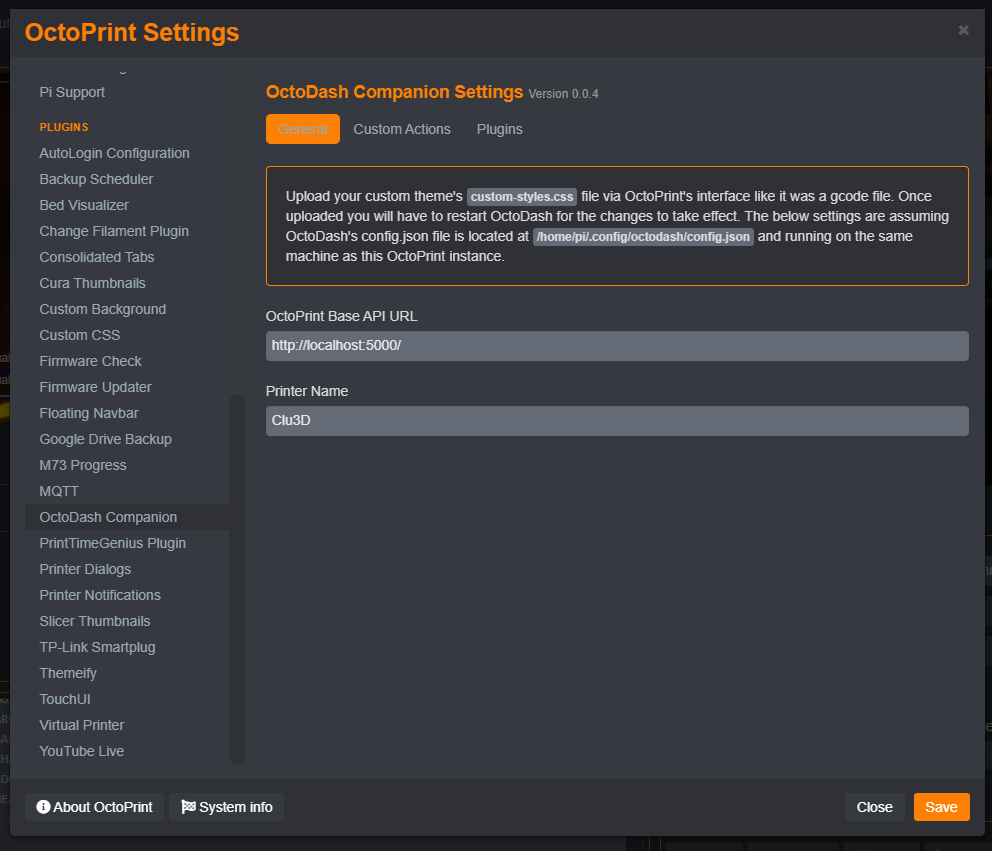
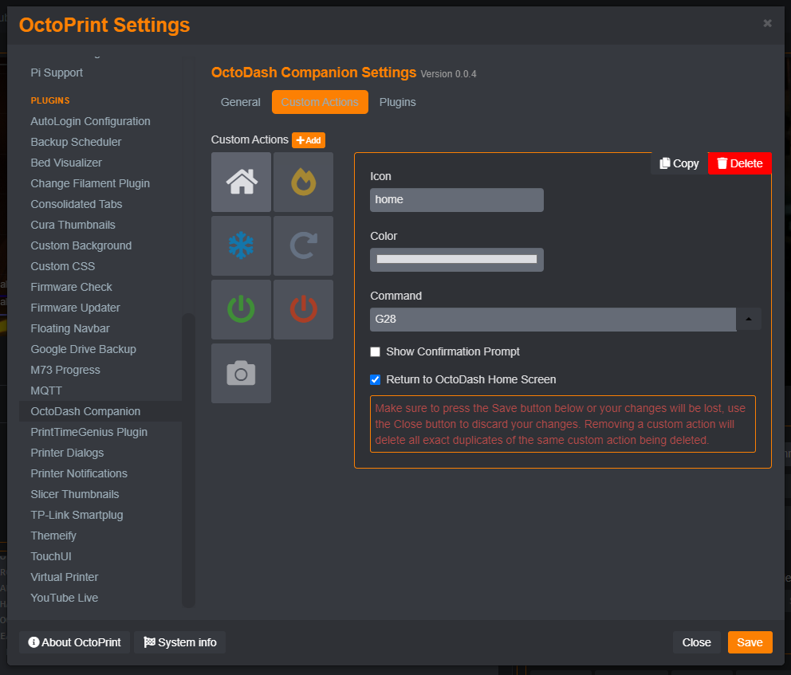
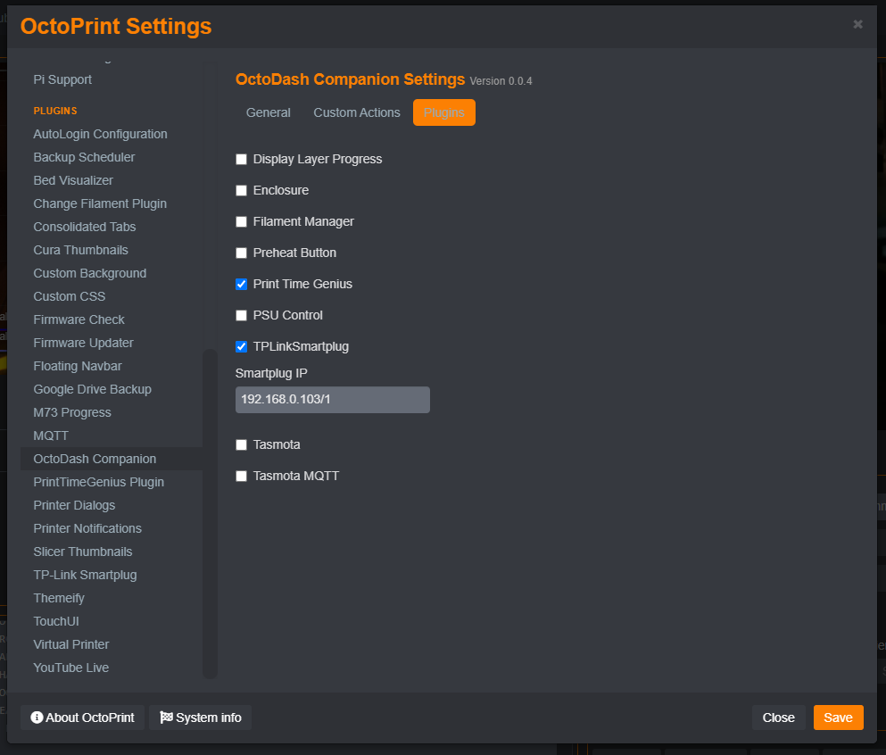

# OctoDash Companion

This plugin allows for configuring OctoDash settings and upload custom theme files from within the OctoPrint interface. It assumes that you have both OctoDash and OctoPrint running on the same physical machine.

## Setup

Install via the bundled [Plugin Manager](https://docs.octoprint.org/en/master/bundledplugins/pluginmanager.html)
or manually using this URL:

    https://github.com/jneilliii/OctoPrint-OctoDashCompanion/archive/master.zip

## Configuration

Once installed you can use the OctoDash Companion General settings to configure the Printer Name and OctoPrint URL. Other settings will be added as deemed necessary.

To upload a new [Custom Theme](https://github.com/UnchartedBull/OctoDash/wiki/Custom-Styles) file, just upload the `custom-styles.css` file to OctoPrint as if it were a gcode file.

Use the Custom Actions tab to configure [Custom Actions](https://github.com/UnchartedBull/OctoDash/wiki/Custom-Actions). As a convenience you can use the drop-down menu for pre-configured known custom actions built-in to OctoDash.

Use the Plugins tab to enable and set specific settings related to OctoPrint plugins that work with OctoDash.

## Sponsors
- Andreas Lindermayr
- [@Mearman](https://github.com/Mearman)
- [@TheTuxKeeper](https://github.com/thetuxkeeper)
- [@tideline3d](https://github.com/tideline3d/)
- [SimplyPrint](https://simplyprint.dk/)
- [Andrew Beeman](https://github.com/Kiendeleo)
- [Calanish](https://github.com/calanish)
- [Will O](https://github.com/4wrxb)
- [Lachlan Bell](https://lachy.io/)
- [Johnny Bergdal](https://github.com/bergdahl)
- [Leigh Johnson](https://github.com/leigh-johnson)
- [Stephen Berry](https://github.com/berrystephenw)
- [Guyot François](https://github.com/iFrostizz)
- César Romero
- [Steve Dougherty](https://github.com/Thynix)
- [Kyle Menigoz](https://menigoz.me)
## Support My Efforts
I, jneilliii, programmed this plugin for fun and do my best effort to support those that have issues with it, please return the favor and leave me a tip or become a Patron if you find this plugin helpful and want me to continue future development.

 

<small>No paypal.me? Send funds via PayPal to jneilliii&#64;gmail&#46;com

You can use [this](https://www.paypal.com/cgi-bin/webscr?cmd=_xclick&business=jneilliii@gmail.com) link too. But the normal PayPal fee will be deducted.
</small>
