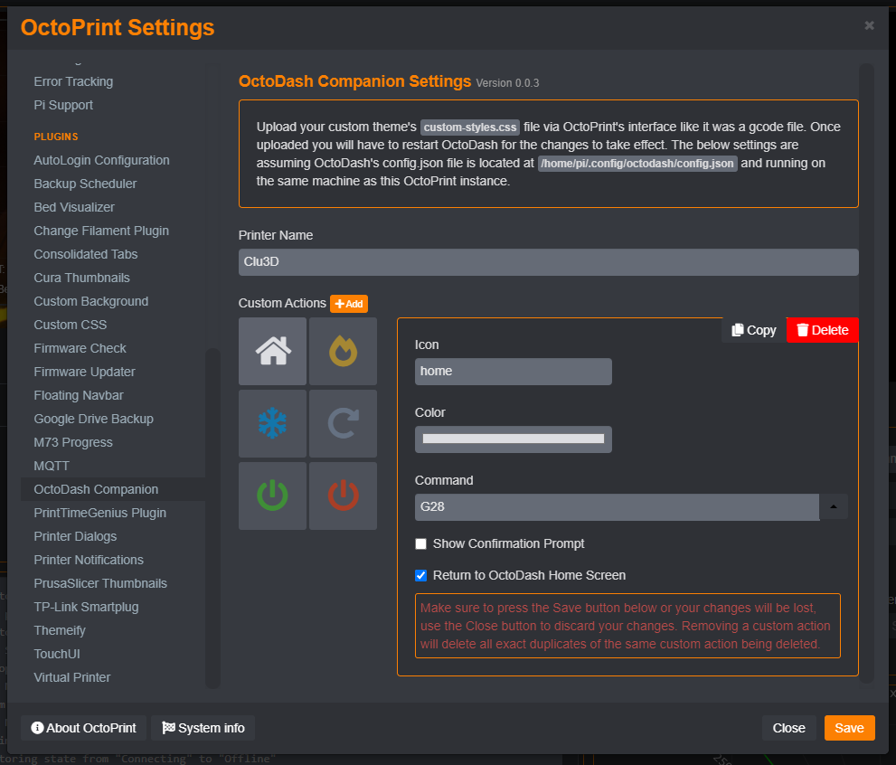

# OctoDash Companion

This plugin allows for configuring OctoDash settings and upload custom theme files from within the OctoPrint interface. It assumes that you have both OctoDash and OctoPrint running on the same physical machine.

## Setup

Install via the bundled [Plugin Manager](https://docs.octoprint.org/en/master/bundledplugins/pluginmanager.html)
or manually using this URL:

    https://github.com/jneilliii/OctoPrint-OctoDashCompanion/archive/master.zip

## Configuration

Once installed you can use the OctoDash Companion settings to configure the Printer Name and [Custom Actions](https://github.com/UnchartedBull/OctoDash/wiki/Custom-Actions). Other settings will be added as deemed necessary.

To upload a new [Custom Theme](https://github.com/UnchartedBull/OctoDash/wiki/Custom-Styles) file, just upload the `custom-styles.css` file to OctoPrint as if it were a gcode file.
